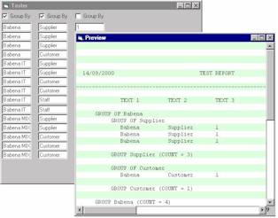



## Reporting Control

### Description

A reporting control to ease printing of reports. The control will also enabled preview of reports, save to file and printing to the printer.

With this control, user have control on the printing format (code level) as to using the a third party ReportWriter
 
### More Info
 
None

             |
---                |---
**Submitted On**   |2000-09-14 11:42:40
**By**             |[Maizuruddin Abd\-Hadi](https://github.com/Planet-Source-Code/PSCIndex/blob/master/ByAuthor/maizuruddin-abd-hadi.md)
**Level**          |Beginner
**User Rating**    |4.0 (24 globes from 6 users)
**Compatibility**  |VB 5\.0, VB 6\.0
**Category**       |[Custom Controls/ Forms/  Menus](https://github.com/Planet-Source-Code/PSCIndex/blob/master/ByCategory/custom-controls-forms-menus__1-4.md)
**World**          |[Visual Basic](https://github.com/Planet-Source-Code/PSCIndex/blob/master/ByWorld/visual-basic.md)
**Archive File**   |[CODE\_UPLOAD98809142000\.zip](https://github.com/Planet-Source-Code/maizuruddin-abd-hadi-reporting-control__1-11441/archive/master.zip)

